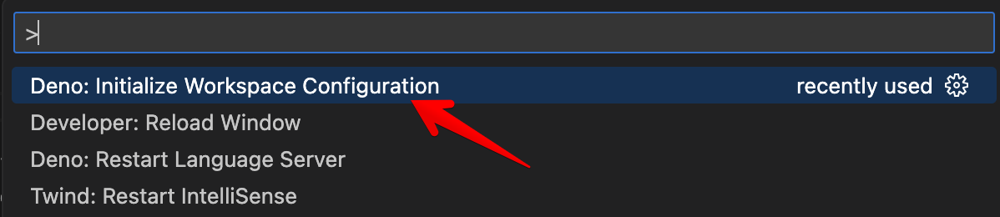

# Chapter-1

## 环境准备

### 安装 Python

> 要求 3.9 以上

Windows 下，可以直接通过官方的包管理工具安装

```bash
winget install Python.Python.3.11
```

macOS/Linux 下，也可以通过类似包管理工具下载，或者从官网下载安装程序。

```bash
# macOS
brew install python@3.11
# Linux Ubuntu
sudo apt-get update
sudo apt-get install python3.11
# Linux CentOS
sudo yum update
sudo yum install python3.11
```

### 安装 Deno

Windows 下，可以直接通过官方的包管理工具安装:

```bash
winget insatll DenoLand.Deno
```

或者通过官网提供的命令行安装:

```bash
irm https://deno.land/install.ps1 | iex
```

macOS/Linux:

```bash
curl -fsSL https://deno.land/install.sh | sh
```

---

使用 Deno 配置 Jupyter（强制安装内核）:

```bash
deno jupyter --unstable --install
```

Deno 附带了一个内置的 Jupyter 内核，`deno jupyter` 目前是一个不稳定的功能，所以使用的时候需要 `--unstable` 标志，后续的发布的版本中此功能将变为稳定。

检查是否安装成功:

```bash
deno jupyter --unstable
```

安装成功会打印: ✅ Deno kernel already installed

### 使用 Jupyter

在浏览器内打开的网页中使用 Jupyter notebook:

```bash
jupyter notebook
```

或者在 VSCode 中安装 Jupyter 拓展（搜索 ms-toolsai.jupyter）:

然后新建一个 `1-test-content.ipynb` Jupyter Notebook 文件，右上角选择内核为 Deno。

添加以下内容，分成两个代码块:

```js
// block 1
import _ from "npm:/lodash@4.17.21";

// block 2
const a = _.random(0, 5);
a
```

Deno 支持导入远程的 npm 包，并且会自动缓存。

通过创建 `deno.json` 文件能简化导入，在根目录下创建文件:

```json
{
  "imports": {
    "lodash": "npm:/lodash@4.17.21"
  },
  "deno.enable": true
}
```

添加 `lodash` 别名后，可以改用指向远程特定版本的 `lodash` 包:

```js
// block 1
import _ from "lodash";

// block 2
const a = _.random(0, 5);
a
```

到这里，会发现文件中一直有 lint 的报错信息。

为了消除导入模块的 lint 报错，需要安装 Deno 拓展（搜索 denoland.vscode-deno）:

然后在 VSCode 命令选项面板搜索并执行 `Deno: Initialize Workspace Configuration` 以初始化当前项目配置。



执行之后会在项目中创建 `.vscode/settings.json` 文件:

```json
{
    "deno.enable": true
}
```

回到 `1-test-content.ipynb` 文件，导入的 lint 报错已经消失了。

在第一个代码块下访问 `a` 不会报错，但是第二个代码块的变量 `a` 引用不存在的 lint 报错还是存在，不影响使用。

## 参考链接

- https://juejin.cn/book/7347579913702293567/section/7347579759179595787
- https://www.python.org/
- https://deno.com/
- https://docs.deno.com/runtime/manual/tools/jupyter
- https://docs.deno.com/runtime/manual/getting_started/first_steps#configure-your-ide